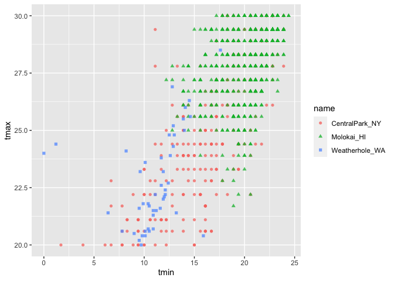
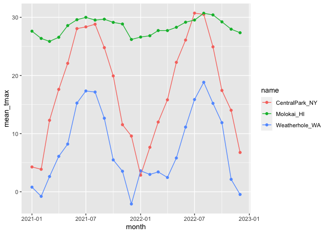
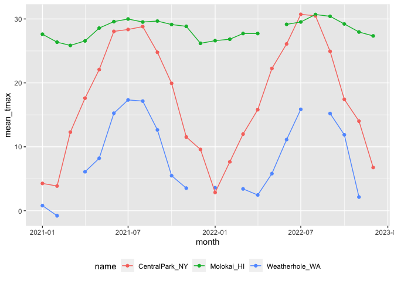
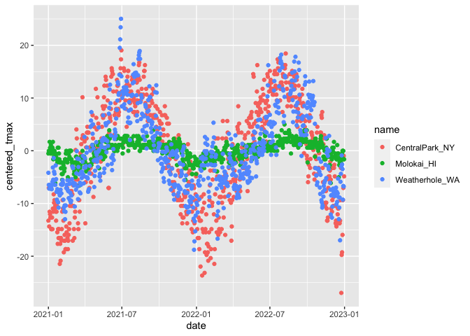

EDA: Numeric summaries
================
Xue Zhang
2023-10-05

Example

``` r
weather_df = 
  rnoaa::meteo_pull_monitors(
    c("USW00094728", "USW00022534", "USS0023B17S"),
    var = c("PRCP", "TMIN", "TMAX"),
    date_min = "2021-01-01",
    date_max = "2022-12-31") |>
  mutate(
    name = recode(
      id,
      USW00094728 = "CentralPark_NY",
      USW00022534 = "Molokai_HI",
      USS0023B17S = "Weatherhole_WA"),
    tmin = tmin / 10,
    tmax = tmax / 10,
    month = lubridate::floor_date(date, unit = "month")) |>
select(name, id, everything())
```

    ## using cached file: /Users/xuezhang/Library/Caches/org.R-project.R/R/rnoaa/noaa_ghcnd/USW00094728.dly

    ## date created (size, mb): 2023-10-05 10:34:12.674646 (8.527)

    ## file min/max dates: 1869-01-01 / 2023-10-31

    ## using cached file: /Users/xuezhang/Library/Caches/org.R-project.R/R/rnoaa/noaa_ghcnd/USW00022534.dly

    ## date created (size, mb): 2023-10-05 10:34:27.331271 (3.832)

    ## file min/max dates: 1949-10-01 / 2023-10-31

    ## using cached file: /Users/xuezhang/Library/Caches/org.R-project.R/R/rnoaa/noaa_ghcnd/USS0023B17S.dly

    ## date created (size, mb): 2023-10-05 10:34:32.015011 (0.997)

    ## file min/max dates: 1999-09-01 / 2023-10-31

Initial numeric explorations

``` r
weather_df |>
  ggplot(aes(x = prcp)) +
  geom_histogram()
```

    ## `stat_bin()` using `bins = 30`. Pick better value with `binwidth`.

    ## Warning: Removed 15 rows containing non-finite values (`stat_bin()`).

<!-- -->

here are the big outliers

``` r
weather_df |>
  filter(prcp >= 1000)
```

    ## # A tibble: 3 × 7
    ##   name           id          date        prcp  tmax  tmin month     
    ##   <chr>          <chr>       <date>     <dbl> <dbl> <dbl> <date>    
    ## 1 CentralPark_NY USW00094728 2021-08-21  1130  27.8  22.8 2021-08-01
    ## 2 CentralPark_NY USW00094728 2021-09-01  1811  25.6  17.2 2021-09-01
    ## 3 Molokai_HI     USW00022534 2022-12-18  1120  23.3  18.9 2022-12-01

``` r
weather_df |>
  filter(tmax >= 20, tmax <= 30) |>
  ggplot(aes(x = tmin, y = tmax, color = name, shape = name)) +
  geom_point(alpha = .75)
```

<!-- -->

## Grouping

``` r
weather_df |>
  group_by(name, month)
```

    ## # A tibble: 2,190 × 7
    ## # Groups:   name, month [72]
    ##    name           id          date        prcp  tmax  tmin month     
    ##    <chr>          <chr>       <date>     <dbl> <dbl> <dbl> <date>    
    ##  1 CentralPark_NY USW00094728 2021-01-01   157   4.4   0.6 2021-01-01
    ##  2 CentralPark_NY USW00094728 2021-01-02    13  10.6   2.2 2021-01-01
    ##  3 CentralPark_NY USW00094728 2021-01-03    56   3.3   1.1 2021-01-01
    ##  4 CentralPark_NY USW00094728 2021-01-04     5   6.1   1.7 2021-01-01
    ##  5 CentralPark_NY USW00094728 2021-01-05     0   5.6   2.2 2021-01-01
    ##  6 CentralPark_NY USW00094728 2021-01-06     0   5     1.1 2021-01-01
    ##  7 CentralPark_NY USW00094728 2021-01-07     0   5    -1   2021-01-01
    ##  8 CentralPark_NY USW00094728 2021-01-08     0   2.8  -2.7 2021-01-01
    ##  9 CentralPark_NY USW00094728 2021-01-09     0   2.8  -4.3 2021-01-01
    ## 10 CentralPark_NY USW00094728 2021-01-10     0   5    -1.6 2021-01-01
    ## # ℹ 2,180 more rows

## Counting

``` r
weather_df |>
  group_by(month) |>
  summarize(n_obs = n())
```

    ## # A tibble: 24 × 2
    ##    month      n_obs
    ##    <date>     <int>
    ##  1 2021-01-01    93
    ##  2 2021-02-01    84
    ##  3 2021-03-01    93
    ##  4 2021-04-01    90
    ##  5 2021-05-01    93
    ##  6 2021-06-01    90
    ##  7 2021-07-01    93
    ##  8 2021-08-01    93
    ##  9 2021-09-01    90
    ## 10 2021-10-01    93
    ## # ℹ 14 more rows

``` r
weather_df |>
  group_by(name, month) |>
  summarize(n_obs = n())
```

    ## `summarise()` has grouped output by 'name'. You can override using the
    ## `.groups` argument.

    ## # A tibble: 72 × 3
    ## # Groups:   name [3]
    ##    name           month      n_obs
    ##    <chr>          <date>     <int>
    ##  1 CentralPark_NY 2021-01-01    31
    ##  2 CentralPark_NY 2021-02-01    28
    ##  3 CentralPark_NY 2021-03-01    31
    ##  4 CentralPark_NY 2021-04-01    30
    ##  5 CentralPark_NY 2021-05-01    31
    ##  6 CentralPark_NY 2021-06-01    30
    ##  7 CentralPark_NY 2021-07-01    31
    ##  8 CentralPark_NY 2021-08-01    31
    ##  9 CentralPark_NY 2021-09-01    30
    ## 10 CentralPark_NY 2021-10-01    31
    ## # ℹ 62 more rows

``` r
weather_df |>
  count(name, month) |>
  pivot_wider(
    names_from = name,
    values_from = n
  )
```

    ## # A tibble: 24 × 4
    ##    month      CentralPark_NY Molokai_HI Weatherhole_WA
    ##    <date>              <int>      <int>          <int>
    ##  1 2021-01-01             31         31             31
    ##  2 2021-02-01             28         28             28
    ##  3 2021-03-01             31         31             31
    ##  4 2021-04-01             30         30             30
    ##  5 2021-05-01             31         31             31
    ##  6 2021-06-01             30         30             30
    ##  7 2021-07-01             31         31             31
    ##  8 2021-08-01             31         31             31
    ##  9 2021-09-01             30         30             30
    ## 10 2021-10-01             31         31             31
    ## # ℹ 14 more rows

## General summaries

``` r
weather_df |>
  group_by(name, month) |>
  summarize(
    mean_tmax = mean(tmax, na.rm = TRUE),
    median_tmax = median(tmax, na.rm = TRUE),
    sd_tmax = sd(tmax, na.rm = TRUE)
  )
```

    ## `summarise()` has grouped output by 'name'. You can override using the
    ## `.groups` argument.

    ## # A tibble: 72 × 5
    ## # Groups:   name [3]
    ##    name           month      mean_tmax median_tmax sd_tmax
    ##    <chr>          <date>         <dbl>       <dbl>   <dbl>
    ##  1 CentralPark_NY 2021-01-01      4.27         5      3.34
    ##  2 CentralPark_NY 2021-02-01      3.87         2.8    3.99
    ##  3 CentralPark_NY 2021-03-01     12.3         12.2    6.91
    ##  4 CentralPark_NY 2021-04-01     17.6         18.0    5.26
    ##  5 CentralPark_NY 2021-05-01     22.1         22.2    5.63
    ##  6 CentralPark_NY 2021-06-01     28.1         27.8    4.32
    ##  7 CentralPark_NY 2021-07-01     28.4         28.3    3.17
    ##  8 CentralPark_NY 2021-08-01     28.8         28.3    2.95
    ##  9 CentralPark_NY 2021-09-01     24.8         24.4    2.52
    ## 10 CentralPark_NY 2021-10-01     19.9         20.6    3.66
    ## # ℹ 62 more rows

``` r
weather_df |>
  group_by(name, month) |>
  summarize(mean_tmax = mean(tmax, na.rm = TRUE)) |>
  ggplot(aes(x = month, y = mean_tmax, color = name)) +
  geom_point() +
  geom_line()
```

    ## `summarise()` has grouped output by 'name'. You can override using the
    ## `.groups` argument.

<!-- -->

``` r
weather_df |>
  group_by(name, month) |>
  summarize(mean_tmax = mean(tmax, na.rm = TRUE)) |>
  pivot_wider(
    names_from = name,
    values_from = mean_tmax
  ) |>
  knitr::kable(digits = 2)
```

    ## `summarise()` has grouped output by 'name'. You can override using the
    ## `.groups` argument.

| month      | CentralPark_NY | Molokai_HI | Weatherhole_WA |
|:-----------|---------------:|-----------:|---------------:|
| 2021-01-01 |           4.27 |      27.62 |           0.80 |
| 2021-02-01 |           3.87 |      26.37 |          -0.79 |
| 2021-03-01 |          12.29 |      25.86 |           2.62 |
| 2021-04-01 |          17.61 |      26.57 |           6.10 |
| 2021-05-01 |          22.08 |      28.58 |           8.20 |
| 2021-06-01 |          28.06 |      29.59 |          15.25 |
| 2021-07-01 |          28.35 |      29.99 |          17.34 |
| 2021-08-01 |          28.81 |      29.52 |          17.15 |
| 2021-09-01 |          24.79 |      29.67 |          12.65 |
| 2021-10-01 |          19.93 |      29.13 |           5.48 |
| 2021-11-01 |          11.54 |      28.85 |           3.53 |
| 2021-12-01 |           9.59 |      26.19 |          -2.10 |
| 2022-01-01 |           2.85 |      26.61 |           3.61 |
| 2022-02-01 |           7.65 |      26.83 |           2.99 |
| 2022-03-01 |          11.99 |      27.73 |           3.42 |
| 2022-04-01 |          15.81 |      27.72 |           2.46 |
| 2022-05-01 |          22.25 |      28.28 |           5.81 |
| 2022-06-01 |          26.09 |      29.16 |          11.13 |
| 2022-07-01 |          30.72 |      29.53 |          15.86 |
| 2022-08-01 |          30.50 |      30.70 |          18.83 |
| 2022-09-01 |          24.92 |      30.41 |          15.21 |
| 2022-10-01 |          17.43 |      29.22 |          11.88 |
| 2022-11-01 |          14.02 |      27.96 |           2.14 |
| 2022-12-01 |           6.76 |      27.35 |          -0.46 |

``` r
weather_df |>
  group_by(month) |>
  summarize(
    n_obs = n(),
    n_days = n_distinct(date)
  )
```

    ## # A tibble: 24 × 3
    ##    month      n_obs n_days
    ##    <date>     <int>  <int>
    ##  1 2021-01-01    93     31
    ##  2 2021-02-01    84     28
    ##  3 2021-03-01    93     31
    ##  4 2021-04-01    90     30
    ##  5 2021-05-01    93     31
    ##  6 2021-06-01    90     30
    ##  7 2021-07-01    93     31
    ##  8 2021-08-01    93     31
    ##  9 2021-09-01    90     30
    ## 10 2021-10-01    93     31
    ## # ℹ 14 more rows

(2 by 2 tables)

``` r
weather_df |>
  mutate(
    cold = case_when(
      tmax < 5  ~ "cold",
      tmax >= 5 ~ "not_cold",
      TRUE      ~ ""
    )
  ) |>
  filter(name != "Waikiki_HA") |>
  group_by(name, cold) |>
  summarize(count = n())
```

    ## `summarise()` has grouped output by 'name'. You can override using the
    ## `.groups` argument.

    ## # A tibble: 7 × 3
    ## # Groups:   name [3]
    ##   name           cold       count
    ##   <chr>          <chr>      <int>
    ## 1 CentralPark_NY "cold"        96
    ## 2 CentralPark_NY "not_cold"   634
    ## 3 Molokai_HI     ""             1
    ## 4 Molokai_HI     "not_cold"   729
    ## 5 Weatherhole_WA ""            16
    ## 6 Weatherhole_WA "cold"       319
    ## 7 Weatherhole_WA "not_cold"   395

``` r
weather_df |>
  mutate(cold = case_when(
    tmax <  5 ~ "cold",
    tmax >= 5 ~ "not_cold",
    TRUE      ~ ""
  ))|>
  filter(name != "Waikiki_HA") |>
  janitor::tabyl(name, cold)
```

    ##            name cold not_cold emptystring_
    ##  CentralPark_NY   96      634            0
    ##      Molokai_HI    0      729            1
    ##  Weatherhole_WA  319      395           16

General summaries

``` r
weather_df |>
  group_by(month) |>
  summarize(
    mean_tmax = mean(tmax),
    mean_prec = mean(prcp, na.rm = TRUE),
    median_tmax = median(tmax),
    sd_tmax = sd(tmax)
  )
```

    ## # A tibble: 24 × 5
    ##    month      mean_tmax mean_prec median_tmax sd_tmax
    ##    <date>         <dbl>     <dbl>       <dbl>   <dbl>
    ##  1 2021-01-01     10.9       39.5         5     12.2 
    ##  2 2021-02-01      9.82      42.6         2.8   12.2 
    ##  3 2021-03-01     NA         55.5        NA     NA   
    ##  4 2021-04-01     16.8       14.7        18.0    9.29
    ##  5 2021-05-01     19.6       17.3        22.2    9.40
    ##  6 2021-06-01     24.3       14.1        28.3    8.28
    ##  7 2021-07-01     25.2       30.7        28.3    6.19
    ##  8 2021-08-01     25.2       30.6        28.3    6.72
    ##  9 2021-09-01     22.4       35.4        24.4    7.69
    ## 10 2021-10-01     18.2       36.0        20.6   10.1 
    ## # ℹ 14 more rows

``` r
weather_df |>
  group_by(name, month) |>
  summarize(
    mean_tmax = mean(tmax),
    median_tmax = median(tmax)
  )
```

    ## `summarise()` has grouped output by 'name'. You can override using the
    ## `.groups` argument.

    ## # A tibble: 72 × 4
    ## # Groups:   name [3]
    ##    name           month      mean_tmax median_tmax
    ##    <chr>          <date>         <dbl>       <dbl>
    ##  1 CentralPark_NY 2021-01-01      4.27         5  
    ##  2 CentralPark_NY 2021-02-01      3.87         2.8
    ##  3 CentralPark_NY 2021-03-01     12.3         12.2
    ##  4 CentralPark_NY 2021-04-01     17.6         18.0
    ##  5 CentralPark_NY 2021-05-01     22.1         22.2
    ##  6 CentralPark_NY 2021-06-01     28.1         27.8
    ##  7 CentralPark_NY 2021-07-01     28.4         28.3
    ##  8 CentralPark_NY 2021-08-01     28.8         28.3
    ##  9 CentralPark_NY 2021-09-01     24.8         24.4
    ## 10 CentralPark_NY 2021-10-01     19.9         20.6
    ## # ℹ 62 more rows

``` r
weather_df |>
  group_by(name, month) |>
  summarize(across(tmin:prcp, mean ))
```

    ## `summarise()` has grouped output by 'name'. You can override using the
    ## `.groups` argument.

    ## # A tibble: 72 × 5
    ## # Groups:   name [3]
    ##    name           month       tmin  tmax  prcp
    ##    <chr>          <date>     <dbl> <dbl> <dbl>
    ##  1 CentralPark_NY 2021-01-01 -1.15  4.27  18.9
    ##  2 CentralPark_NY 2021-02-01 -1.39  3.87  46.6
    ##  3 CentralPark_NY 2021-03-01  3.1  12.3   28.0
    ##  4 CentralPark_NY 2021-04-01  7.48 17.6   22.8
    ##  5 CentralPark_NY 2021-05-01 12.2  22.1   35.7
    ##  6 CentralPark_NY 2021-06-01 18.9  28.1   22.2
    ##  7 CentralPark_NY 2021-07-01 20.6  28.4   90.9
    ##  8 CentralPark_NY 2021-08-01 21.8  28.8   84.5
    ##  9 CentralPark_NY 2021-09-01 17.8  24.8   84.9
    ## 10 CentralPark_NY 2021-10-01 13.4  19.9   43.1
    ## # ℹ 62 more rows

``` r
weather_df |>
  group_by(name, month) |>
  summarize(mean_tmax = mean(tmax)) |>
  ggplot(aes(x = month, y = mean_tmax, color = name)) +
    geom_point() + geom_line() +
    theme(legend.position = "bottom")
```

    ## `summarise()` has grouped output by 'name'. You can override using the
    ## `.groups` argument.

    ## Warning: Removed 6 rows containing missing values (`geom_point()`).

    ## Warning: Removed 1 row containing missing values (`geom_line()`).

<!-- -->

``` r
weather_df |>
  group_by(name, month) |>
  summarize(mean_tmax = mean(tmax)) |>
  pivot_wider(
    names_from = name,
    values_from = mean_tmax) |>
  knitr::kable(digits = 1)
```

    ## `summarise()` has grouped output by 'name'. You can override using the
    ## `.groups` argument.

| month      | CentralPark_NY | Molokai_HI | Weatherhole_WA |
|:-----------|---------------:|-----------:|---------------:|
| 2021-01-01 |            4.3 |       27.6 |            0.8 |
| 2021-02-01 |            3.9 |       26.4 |           -0.8 |
| 2021-03-01 |           12.3 |       25.9 |             NA |
| 2021-04-01 |           17.6 |       26.6 |            6.1 |
| 2021-05-01 |           22.1 |       28.6 |            8.2 |
| 2021-06-01 |           28.1 |       29.6 |           15.3 |
| 2021-07-01 |           28.4 |       30.0 |           17.3 |
| 2021-08-01 |           28.8 |       29.5 |           17.2 |
| 2021-09-01 |           24.8 |       29.7 |           12.6 |
| 2021-10-01 |           19.9 |       29.1 |            5.5 |
| 2021-11-01 |           11.5 |       28.8 |            3.5 |
| 2021-12-01 |            9.6 |       26.2 |             NA |
| 2022-01-01 |            2.9 |       26.6 |            3.6 |
| 2022-02-01 |            7.7 |       26.8 |             NA |
| 2022-03-01 |           12.0 |       27.7 |            3.4 |
| 2022-04-01 |           15.8 |       27.7 |            2.5 |
| 2022-05-01 |           22.3 |         NA |            5.8 |
| 2022-06-01 |           26.1 |       29.2 |           11.1 |
| 2022-07-01 |           30.7 |       29.5 |           15.9 |
| 2022-08-01 |           30.5 |       30.7 |             NA |
| 2022-09-01 |           24.9 |       30.4 |           15.2 |
| 2022-10-01 |           17.4 |       29.2 |           11.9 |
| 2022-11-01 |           14.0 |       28.0 |            2.1 |
| 2022-12-01 |            6.8 |       27.3 |             NA |

## Grouped mutate

``` r
weather_df |>
  group_by(name) |>
  mutate(
    mean_tmax = mean(tmax, na.rm = TRUE))
```

    ## # A tibble: 2,190 × 8
    ## # Groups:   name [3]
    ##    name           id          date        prcp  tmax  tmin month      mean_tmax
    ##    <chr>          <chr>       <date>     <dbl> <dbl> <dbl> <date>         <dbl>
    ##  1 CentralPark_NY USW00094728 2021-01-01   157   4.4   0.6 2021-01-01      17.7
    ##  2 CentralPark_NY USW00094728 2021-01-02    13  10.6   2.2 2021-01-01      17.7
    ##  3 CentralPark_NY USW00094728 2021-01-03    56   3.3   1.1 2021-01-01      17.7
    ##  4 CentralPark_NY USW00094728 2021-01-04     5   6.1   1.7 2021-01-01      17.7
    ##  5 CentralPark_NY USW00094728 2021-01-05     0   5.6   2.2 2021-01-01      17.7
    ##  6 CentralPark_NY USW00094728 2021-01-06     0   5     1.1 2021-01-01      17.7
    ##  7 CentralPark_NY USW00094728 2021-01-07     0   5    -1   2021-01-01      17.7
    ##  8 CentralPark_NY USW00094728 2021-01-08     0   2.8  -2.7 2021-01-01      17.7
    ##  9 CentralPark_NY USW00094728 2021-01-09     0   2.8  -4.3 2021-01-01      17.7
    ## 10 CentralPark_NY USW00094728 2021-01-10     0   5    -1.6 2021-01-01      17.7
    ## # ℹ 2,180 more rows

``` r
weather_df |>
  group_by(name) |>
  mutate(
    mean_tmax = mean(tmax, na.rm = TRUE),
    centered_tmax = tmax - mean_tmax) |>
  ggplot(aes(x = date, y = centered_tmax, color = name)) +
  geom_point()
```

    ## Warning: Removed 17 rows containing missing values (`geom_point()`).

<!-- -->

Window functions

``` r
weather_df |>
  group_by(name, month) |>
  mutate(temp_ranking = min_rank(tmax))
```

    ## # A tibble: 2,190 × 8
    ## # Groups:   name, month [72]
    ##    name           id        date        prcp  tmax  tmin month      temp_ranking
    ##    <chr>          <chr>     <date>     <dbl> <dbl> <dbl> <date>            <int>
    ##  1 CentralPark_NY USW00094… 2021-01-01   157   4.4   0.6 2021-01-01           14
    ##  2 CentralPark_NY USW00094… 2021-01-02    13  10.6   2.2 2021-01-01           31
    ##  3 CentralPark_NY USW00094… 2021-01-03    56   3.3   1.1 2021-01-01           13
    ##  4 CentralPark_NY USW00094… 2021-01-04     5   6.1   1.7 2021-01-01           20
    ##  5 CentralPark_NY USW00094… 2021-01-05     0   5.6   2.2 2021-01-01           19
    ##  6 CentralPark_NY USW00094… 2021-01-06     0   5     1.1 2021-01-01           16
    ##  7 CentralPark_NY USW00094… 2021-01-07     0   5    -1   2021-01-01           16
    ##  8 CentralPark_NY USW00094… 2021-01-08     0   2.8  -2.7 2021-01-01            8
    ##  9 CentralPark_NY USW00094… 2021-01-09     0   2.8  -4.3 2021-01-01            8
    ## 10 CentralPark_NY USW00094… 2021-01-10     0   5    -1.6 2021-01-01           16
    ## # ℹ 2,180 more rows

``` r
weather_df |>
  group_by(name, month) |>
  mutate(tmax_rank = min_rank(tmax)) |>
  filter(tmax_rank < 2)
```

    ## # A tibble: 92 × 8
    ## # Groups:   name, month [72]
    ##    name           id          date        prcp  tmax  tmin month      tmax_rank
    ##    <chr>          <chr>       <date>     <dbl> <dbl> <dbl> <date>         <int>
    ##  1 CentralPark_NY USW00094728 2021-01-29     0  -3.8  -9.9 2021-01-01         1
    ##  2 CentralPark_NY USW00094728 2021-02-08     0  -1.6  -8.2 2021-02-01         1
    ##  3 CentralPark_NY USW00094728 2021-03-02     0   0.6  -6   2021-03-01         1
    ##  4 CentralPark_NY USW00094728 2021-04-02     0   3.9  -2.1 2021-04-01         1
    ##  5 CentralPark_NY USW00094728 2021-05-29   117  10.6   8.3 2021-05-01         1
    ##  6 CentralPark_NY USW00094728 2021-05-30   226  10.6   8.3 2021-05-01         1
    ##  7 CentralPark_NY USW00094728 2021-06-11     0  20.6  16.7 2021-06-01         1
    ##  8 CentralPark_NY USW00094728 2021-06-12     0  20.6  16.7 2021-06-01         1
    ##  9 CentralPark_NY USW00094728 2021-07-03    86  18.9  15   2021-07-01         1
    ## 10 CentralPark_NY USW00094728 2021-08-04     0  24.4  19.4 2021-08-01         1
    ## # ℹ 82 more rows

logs

``` r
weather_df |>
  group_by(name) |>
  mutate(yesterday_tmax = lag(tmax, 3))
```

    ## # A tibble: 2,190 × 8
    ## # Groups:   name [3]
    ##    name           id      date        prcp  tmax  tmin month      yesterday_tmax
    ##    <chr>          <chr>   <date>     <dbl> <dbl> <dbl> <date>              <dbl>
    ##  1 CentralPark_NY USW000… 2021-01-01   157   4.4   0.6 2021-01-01           NA  
    ##  2 CentralPark_NY USW000… 2021-01-02    13  10.6   2.2 2021-01-01           NA  
    ##  3 CentralPark_NY USW000… 2021-01-03    56   3.3   1.1 2021-01-01           NA  
    ##  4 CentralPark_NY USW000… 2021-01-04     5   6.1   1.7 2021-01-01            4.4
    ##  5 CentralPark_NY USW000… 2021-01-05     0   5.6   2.2 2021-01-01           10.6
    ##  6 CentralPark_NY USW000… 2021-01-06     0   5     1.1 2021-01-01            3.3
    ##  7 CentralPark_NY USW000… 2021-01-07     0   5    -1   2021-01-01            6.1
    ##  8 CentralPark_NY USW000… 2021-01-08     0   2.8  -2.7 2021-01-01            5.6
    ##  9 CentralPark_NY USW000… 2021-01-09     0   2.8  -4.3 2021-01-01            5  
    ## 10 CentralPark_NY USW000… 2021-01-10     0   5    -1.6 2021-01-01            5  
    ## # ℹ 2,180 more rows

``` r
weather_df |>
  group_by(name) |>
  mutate(temp_change = tmax - lag(tmax))
```

    ## # A tibble: 2,190 × 8
    ## # Groups:   name [3]
    ##    name           id         date        prcp  tmax  tmin month      temp_change
    ##    <chr>          <chr>      <date>     <dbl> <dbl> <dbl> <date>           <dbl>
    ##  1 CentralPark_NY USW000947… 2021-01-01   157   4.4   0.6 2021-01-01      NA    
    ##  2 CentralPark_NY USW000947… 2021-01-02    13  10.6   2.2 2021-01-01       6.2  
    ##  3 CentralPark_NY USW000947… 2021-01-03    56   3.3   1.1 2021-01-01      -7.3  
    ##  4 CentralPark_NY USW000947… 2021-01-04     5   6.1   1.7 2021-01-01       2.8  
    ##  5 CentralPark_NY USW000947… 2021-01-05     0   5.6   2.2 2021-01-01      -0.5  
    ##  6 CentralPark_NY USW000947… 2021-01-06     0   5     1.1 2021-01-01      -0.600
    ##  7 CentralPark_NY USW000947… 2021-01-07     0   5    -1   2021-01-01       0    
    ##  8 CentralPark_NY USW000947… 2021-01-08     0   2.8  -2.7 2021-01-01      -2.2  
    ##  9 CentralPark_NY USW000947… 2021-01-09     0   2.8  -4.3 2021-01-01       0    
    ## 10 CentralPark_NY USW000947… 2021-01-10     0   5    -1.6 2021-01-01       2.2  
    ## # ℹ 2,180 more rows

``` r
weather_df |>
  group_by(name) |>
  mutate(temp_change = tmax - lag(tmax)) |>
  summarize(
    temp_change_sd = sd(temp_change, na.rm = TRUE),
    temp_change_max = max(temp_change, na.rm = TRUE)
  )
```

    ## # A tibble: 3 × 3
    ##   name           temp_change_sd temp_change_max
    ##   <chr>                   <dbl>           <dbl>
    ## 1 CentralPark_NY           4.43            12.2
    ## 2 Molokai_HI               1.24             5.6
    ## 3 Weatherhole_WA           3.04            11.1

Limitations
