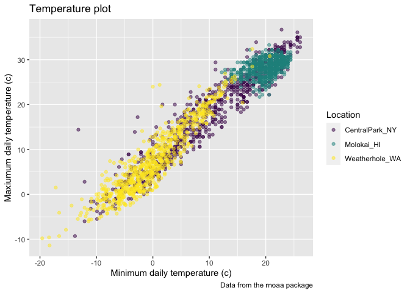
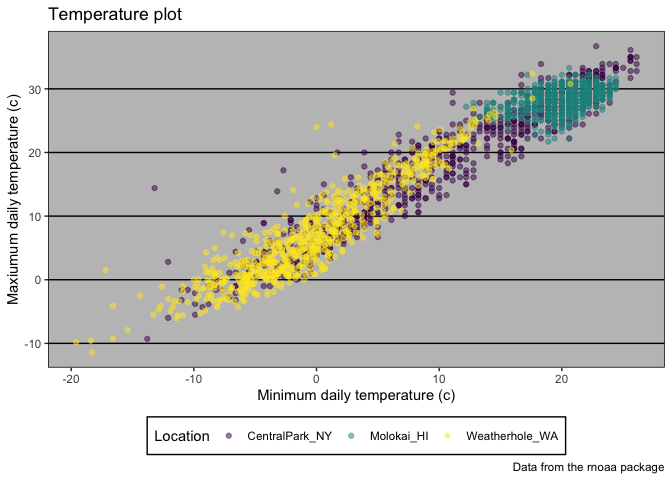

viz_2
================
Xue Zhang
2023-10-03

``` r
weather_df = 
  rnoaa::meteo_pull_monitors(
    c("USW00094728", "USW00022534", "USS0023B17S"),
    var = c("PRCP", "TMIN", "TMAX"),
    date_min = "2021-01-01",
    date_max = "2022-12-31") |>
  mutate(
    name = recode(
      id,
      USW00094728 = "CentralPark_NY",
      USW00022534 = "Molokai_HI",
      USS0023B17S = "Weatherhole_WA"),
    tmin = tmin / 10,
    tmax = tmax / 10) |>
  select(name, id, everything())
```

    ## using cached file: /Users/xuezhang/Library/Caches/org.R-project.R/R/rnoaa/noaa_ghcnd/USW00094728.dly

    ## date created (size, mb): 2023-10-03 10:32:18.645481 (8.525)

    ## file min/max dates: 1869-01-01 / 2023-09-30

    ## using cached file: /Users/xuezhang/Library/Caches/org.R-project.R/R/rnoaa/noaa_ghcnd/USW00022534.dly

    ## date created (size, mb): 2023-10-03 10:32:36.518721 (3.83)

    ## file min/max dates: 1949-10-01 / 2023-09-30

    ## using cached file: /Users/xuezhang/Library/Caches/org.R-project.R/R/rnoaa/noaa_ghcnd/USS0023B17S.dly

    ## date created (size, mb): 2023-10-03 10:32:35.685043 (0.994)

    ## file min/max dates: 1999-09-01 / 2023-09-30

``` r
weather_df
```

    ## # A tibble: 2,190 × 6
    ##    name           id          date        prcp  tmax  tmin
    ##    <chr>          <chr>       <date>     <dbl> <dbl> <dbl>
    ##  1 CentralPark_NY USW00094728 2021-01-01   157   4.4   0.6
    ##  2 CentralPark_NY USW00094728 2021-01-02    13  10.6   2.2
    ##  3 CentralPark_NY USW00094728 2021-01-03    56   3.3   1.1
    ##  4 CentralPark_NY USW00094728 2021-01-04     5   6.1   1.7
    ##  5 CentralPark_NY USW00094728 2021-01-05     0   5.6   2.2
    ##  6 CentralPark_NY USW00094728 2021-01-06     0   5     1.1
    ##  7 CentralPark_NY USW00094728 2021-01-07     0   5    -1  
    ##  8 CentralPark_NY USW00094728 2021-01-08     0   2.8  -2.7
    ##  9 CentralPark_NY USW00094728 2021-01-09     0   2.8  -4.3
    ## 10 CentralPark_NY USW00094728 2021-01-10     0   5    -1.6
    ## # ℹ 2,180 more rows

``` r
weather_df |>
  ggplot(aes(x = tmin, y = tmax)) +
  geom_point(aes(color = name), alpha = .5)
```

    ## Warning: Removed 17 rows containing missing values (`geom_point()`).

<!-- -->

Labels

``` r
weather_df |>
  ggplot(aes(x = tmin, y = tmax)) +
  geom_point(aes(color = name), alpha = .5) +
  labs(
    title = "Temperature plot",
    x = "Minimum daily temperature (c)",
    y = "Maxiumum daily temperature (c)",
    color = "Location",
    caption = "Data from the rnoaa package"
  )
```

    ## Warning: Removed 17 rows containing missing values (`geom_point()`).

<!-- -->

Scales

``` r
weather_df |>
  ggplot(aes(x = tmin, y = tmax)) +
  geom_point(aes(color = name), alpha = .5) +
  labs(
    title = "Temperature plot",
    x = "Minimum daily temperature (c)",
    y = "Maxiumum daily temperature (c)",
    color = "Location",
    caption = "Data from the rnoaa package") +
  scale_x_continuous(
    breaks = c(-15, 0, 15),
    labels = c("-15 C", "0", "15")
  )
```

    ## Warning: Removed 17 rows containing missing values (`geom_point()`).

<!-- -->

``` r
weather_df |>
  ggplot(aes(x = tmin, y = tmax)) +
  geom_point(aes(color = name), alpha = .5) +
  labs(
    title = "Temperature plot",
    x = "Minimum daily temperature (c)",
    y = "Maxiumum daily temperature (c)",
    color = "Location",
    caption = "Data from the rnoaa package") +
  scale_x_continuous(
    breaks = c(-15, 0, 15),
    labels = c("-15 C", "0", "15"),
    limits = c(-20, 30)) +
  scale_y_continuous(
    trans = "sqrt",
    position = "right"
  )
```

    ## Warning in self$trans$transform(x): NaNs produced

    ## Warning: Transformation introduced infinite values in continuous y-axis

    ## Warning: Removed 142 rows containing missing values (`geom_point()`).

<!-- -->

``` r
weather_df |>
  ggplot(aes(x = tmin, y = tmax)) +
  geom_point(aes(color = name), alpha = .5) +
  labs(
    title = "Temperature plot",
    x = "Minimum daily temperature (c)",
    y = "Maxiumum daily temperature (c)",
    color = "Location",
    caption = "Data from the rnoaa package") +
  scale_color_hue(h = c(100, 300))
```

    ## Warning: Removed 17 rows containing missing values (`geom_point()`).

<!-- -->

``` r
ggp_temp_plot =
  weather_df |>
  ggplot(aes(x = tmin, y = tmax)) +
  geom_point(aes(color = name), alpha = .5) +
  labs(
    title = "Temperature plot",
    x = "Minimum daily temperature (c)",
    y = "Maxiumum daily temperature (c)",
    color = "Location",
    caption = "Data from the rnoaa package") +
  viridis::scale_color_viridis(
    name = "Location",
    discrete = TRUE
  )

ggp_temp_plot
```

    ## Warning: Removed 17 rows containing missing values (`geom_point()`).

<!-- -->

Themes

``` r
ggp_temp_plot +
  theme(legend.position = "bottom")
```

    ## Warning: Removed 17 rows containing missing values (`geom_point()`).

<!-- -->

``` r
ggp_temp_plot +
  theme_bw() +
  theme(legend.position = "bottom")
```

    ## Warning: Removed 17 rows containing missing values (`geom_point()`).

<!-- -->

``` r
ggp_temp_plot +
  theme_classic() +
  theme(legend.position = "bottom")
```

    ## Warning: Removed 17 rows containing missing values (`geom_point()`).

<!-- -->

``` r
ggp_temp_plot +
  ggthemes::theme_excel() +
  theme(legend.position = "bottom")
```

    ## Warning: Removed 17 rows containing missing values (`geom_point()`).

<!-- -->

Setting options

``` r
knitr::opts_chunk$set(
  fig.width = 6,
  fig.asp = .6,
  out.width = "908"
)

theme_set(theme_minimal() + theme(legend.position = "bottom"))

options(
  ggplot2.continuous.colour = "viridis",
  ggplot2.continuous.fill = "viridis"
)

scale_colour_discrete = scale_colour_viridis_d
scale_fill_discrete = scale_fill_viridis_d         
```

``` r
central_park_df =
  weather_df |>
  filter(name == "CentralPark_NY")

molokai_df =
  weather_df |>
  filter(name == "Molokai_HI")

ggplot(data = molokai_df, aes(x = date, y = tmax, color = name)) +
  geom_point() +
  geom_line(data = central_park_df)
```

    ## Warning: Removed 1 rows containing missing values (`geom_point()`).


patchwork

``` r
tmax_tmin_p =
  weather_df |>
  ggplot(aes(x = tmax, y = tmin, color = name)) +
  geom_point(alpha = .5) +
  theme(legend.position =  "none")

prcp_dens_p =
  weather_df |>
  filter(prcp > 0) |>
  ggplot(aes(x = prcp, fill = name)) +
  geom_density(alpha = .5) +
  theme(legend.position =  "none")

tmax_date_p = 
  weather_df |>
  ggplot(aes(x = date, y = tmax, color = name)) +
  geom_point(alpha = .5) +
  geom_smooth(se = FALSE) +
  theme(legend.position =  "bottom")

(tmax_tmin_p + prcp_dens_p) / tmax_date_p
```

    ## Warning: Removed 17 rows containing missing values (`geom_point()`).

    ## `geom_smooth()` using method = 'loess' and formula = 'y ~ x'

    ## Warning: Removed 17 rows containing non-finite values (`stat_smooth()`).
    ## Removed 17 rows containing missing values (`geom_point()`).


Data manipulation

``` r
weather_df |>
  mutate(name = forcats::fct_relevel(name, c("Molokai_HI", "CentralPark_NY", "Weatherhole_WA"))) |>
  ggplot(aes(x = name, y = tmax)) +
  geom_violin(aes(fill = name), color = "blue", alpha = .5) +
  theme(legend.position = "bottom")
```

    ## Warning: Removed 17 rows containing non-finite values (`stat_ydensity()`).


``` r
weather_df |>
  mutate(name = forcats::fct_reorder(name, tmax)) |>
  ggplot(aes(x = name, y = tmax)) +
  geom_violin(aes(fill = name), color = "blue", alpha = .5) +
  theme(legend.position = "bottom")
```

    ## Warning: There was 1 warning in `mutate()`.
    ## ℹ In argument: `name = forcats::fct_reorder(name, tmax)`.
    ## Caused by warning:
    ## ! `fct_reorder()` removing 17 missing values.
    ## ℹ Use `.na_rm = TRUE` to silence this message.
    ## ℹ Use `.na_rm = FALSE` to preserve NAs.

    ## Warning: Removed 17 rows containing non-finite values (`stat_ydensity()`).


``` r
weather_df |>
  select(name, tmax, tmin) |>
  pivot_longer(
    tmax:tmin,
    names_to = "observation",
    values_to = "temp") |>
  ggplot(aes(x = temp, fill = observation)) + 
  geom_density(alpha = .5) +
  facet_grid(~name) +
  viridis::scale_fill_viridis(discrete = TRUE)
```

    ## Warning: Removed 34 rows containing non-finite values (`stat_density()`).


``` r
pulse_data =
  haven::read_sas("data/public_pulse_data.sas7bdat") |>
  janitor::clean_names() |>
  pivot_longer(
    bdi_score_bl:bdi_score_12m,
    names_to = "visit",
    names_prefix = "bdi_score_",
    values_to = "bdi") |>
  select(id, visit, everything()) |>
  mutate(
    visit = recode(visit, "bl" = "oom"),
    visit = factor(visit, levels = str_c(c("00", "01", "06", "12"), "m"))) |>
  arrange(id, visit)

ggplot(pulse_data, aes(x = visit, y = bdi)) +
  geom_boxplot()
```

    ## Warning: Removed 879 rows containing non-finite values (`stat_boxplot()`).


``` r
pup_data = 
  read_csv("data/FAS_pups.csv") |>
  janitor::clean_names() |>
  mutate(
    sex =
      case_match(
        sex, 
        1 ~ "male",
        2 ~ "female"
      )
  )
```

    ## Rows: 313 Columns: 6
    ## ── Column specification ────────────────────────────────────────────────────────
    ## Delimiter: ","
    ## chr (1): Litter Number
    ## dbl (5): Sex, PD ears, PD eyes, PD pivot, PD walk
    ## 
    ## ℹ Use `spec()` to retrieve the full column specification for this data.
    ## ℹ Specify the column types or set `show_col_types = FALSE` to quiet this message.

``` r
litter_data =
  read_csv("data/FAS_litters.csv") |>
  janitor::clean_names() |>
  separate(group, into = c("dose", "day_of_tx"), sep = 3)
```

    ## Rows: 49 Columns: 8
    ## ── Column specification ────────────────────────────────────────────────────────
    ## Delimiter: ","
    ## chr (2): Group, Litter Number
    ## dbl (6): GD0 weight, GD18 weight, GD of Birth, Pups born alive, Pups dead @ ...
    ## 
    ## ℹ Use `spec()` to retrieve the full column specification for this data.
    ## ℹ Specify the column types or set `show_col_types = FALSE` to quiet this message.

``` r
fas_data = left_join(pup_data, litter_data, by = "litter_number")

fas_data |>
  select(sex, dose, day_of_tx, pd_ears:pd_walk) |>
  pivot_longer(
    pd_ears:pd_walk,
    names_to = "outcome",
    values_to = "pn_day") |>
  drop_na() |>
  mutate(outcome = forcats::fct_reorder(outcome, pn_day, median)) |>
  ggplot(aes(x = dose, y = pn_day)) +
  geom_violin() +
  facet_grid(day_of_tx ~ outcome)
```


